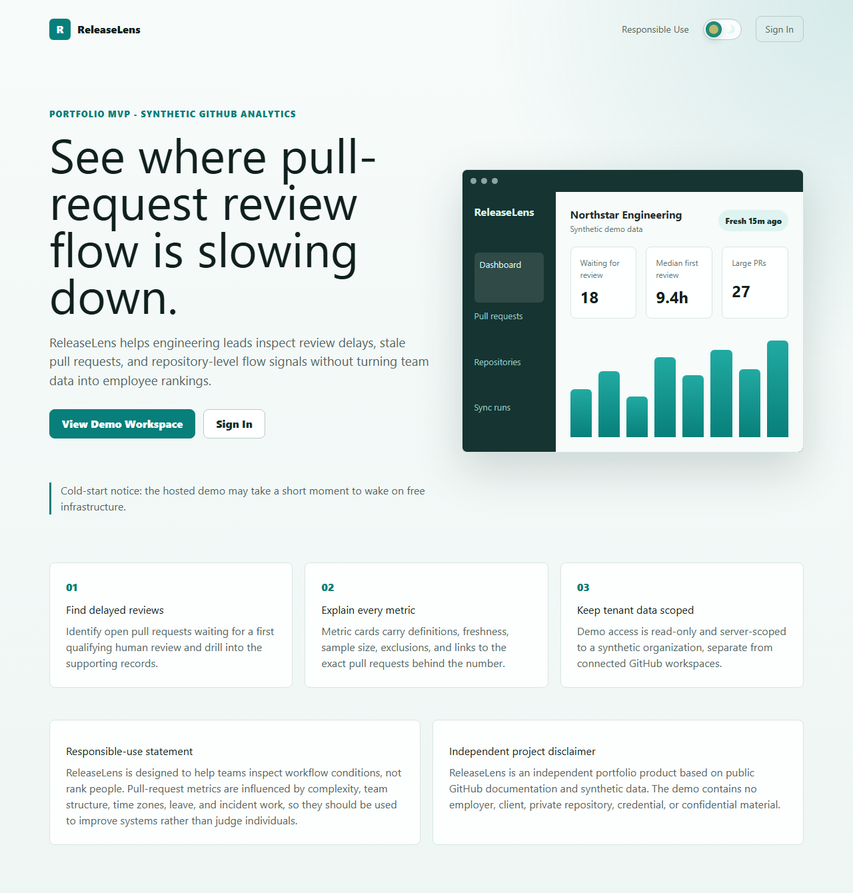
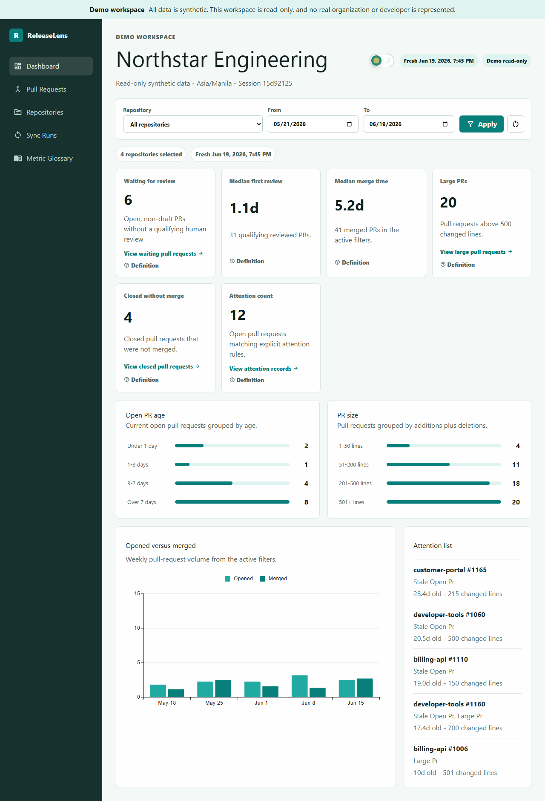
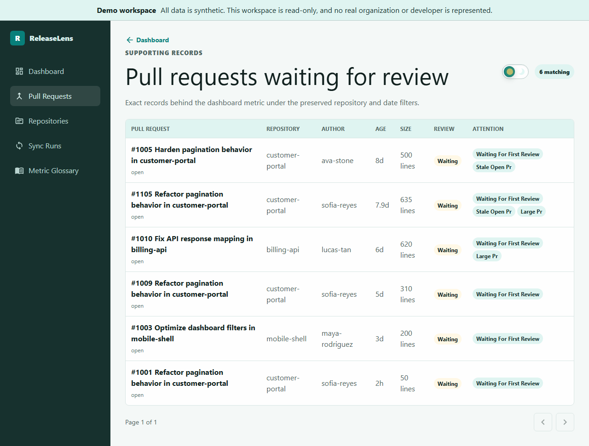
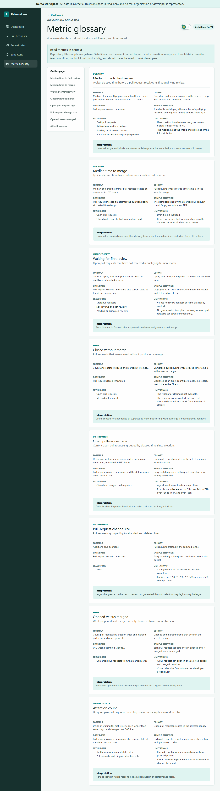
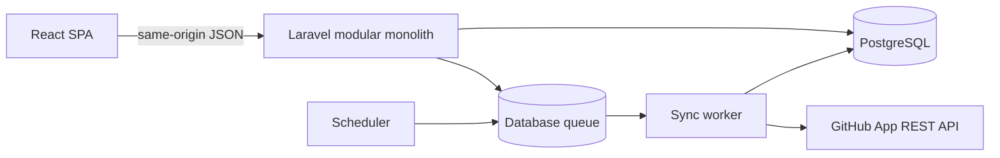

# ReleaseLens

ReleaseLens is a React and Laravel application for finding pull requests and repositories where review and merge flow is slowing down. It combines a one-click deterministic demo with private, read-only GitHub App workspaces.

ReleaseLens reports team and repository workflow conditions. It does not rank developers or calculate individual productivity scores.

> **Deployment status:** the public URL has not been published yet. Free hosted services may cold start; the UI exposes a controlled waiting and retry state.

## Product Tour

The demo requires no registration or GitHub authorization:

1. Open the application and select **View Demo Workspace**.
2. Inspect dashboard metrics, filters, trends, distributions, and attention records.
3. Open a metric or chart segment to see the exact supporting pull requests.
4. Open **Metric Glossary** for formulas, cohorts, exclusions, and limitations.

| Landing | Dashboard |
| --- | --- |
|  |  |

| Pull-request explorer | Metric glossary |
| --- | --- |
|  |  |

All demo identities, repositories, and activity are fictional. This independent portfolio project contains no employer, client, credential, private repository, or confidential material.

## What V1 Does

- Registers users and manages multi-tenant organizations with Owner, Manager, and Viewer roles.
- Connects a least-privilege GitHub App with read-only Metadata and Pull requests permissions.
- Selects monitored repositories and imports bounded PR/review history.
- Runs idempotent manual and six-hour scheduled polling with visible run diagnostics.
- Calculates explainable first-review, merge-time, waiting, closure, age, size, flow, and attention metrics.
- Reconciles dashboard values with server-paginated pull-request drill-downs.
- Provides a deterministic, anonymous, read-only demo workspace.

V1 intentionally excludes webhooks, source-code ingestion, GitHub write actions, releases, deployments, incidents, notifications, billing, AI, and individual performance scoring.

## Architecture

ReleaseLens is a modular monolith. React provides the SPA; Laravel owns sessions, policies, domain services, GitHub synchronization, and analytics; PostgreSQL stores normalized records; database-backed workers process synchronization.



Read the [architecture diagrams](docs/architecture/README.md), [ADRs](docs/adr/README.md), and [V1 trade-offs](docs/trade-offs.md).

## Technology

- Frontend: React 19, TypeScript, Vite, Tailwind CSS, MUI/X Charts, TanStack Query, Redux Toolkit, React Hook Form, Zod.
- Backend: PHP 8.3, Laravel 13, modular services and repository interfaces, database queues and scheduler.
- Data: PostgreSQL in containers/hosting; SQLite is supported for lightweight local development and tests.
- Quality: PHPUnit, Vitest, Testing Library, MSW, Playwright, axe, ESLint, TypeScript, Pint, Composer/npm audit.
- Delivery: GitHub Actions and one multi-stage Docker image used by web, worker, and scheduler processes.

## Local Development

Requirements: PHP 8.3, Composer, Node.js 20, npm, and PostgreSQL or SQLite.

```powershell
cd backend
Copy-Item .env.example .env
composer install
php artisan key:generate
php artisan migrate --seed
php artisan serve
```

Run the queue worker and scheduler in separate terminals:

```powershell
cd backend
php artisan queue:work --tries=3 --timeout=840
```

```powershell
cd backend
php artisan schedule:work
```

Run the frontend:

```powershell
cd frontend
Copy-Item .env.example .env
npm ci
npm run dev
```

Open `http://localhost:5173`. `Sync now` only queues work; without `queue:work`, a run correctly remains queued.

## Docker Setup

```powershell
Copy-Item docker/.env.example .env
cd backend
php artisan key:generate --show
cd ..
# Put the generated APP_KEY in the root .env.
docker compose up --build
```

Open `http://localhost:8080`. Compose starts PostgreSQL, migrations, web, worker, and scheduler services. Readiness is available at `/api/v1/health`; lightweight liveness is `/up`.

## Configuration

Keep real values only in untracked `.env` files or hosted secret stores.

| Variable | Purpose |
| --- | --- |
| `APP_KEY` | Laravel encryption key generated with `php artisan key:generate`. |
| `APP_URL`, `CLIENT_URL` | Canonical public origin; use the same HTTPS URL in the recommended deployment. |
| `DB_*` or `DB_URL` | PostgreSQL connection; require TLS when hosted. |
| `SESSION_*` | Database sessions and production secure/same-site cookie behavior. |
| `QUEUE_CONNECTION` | Use `database`; a worker process must be running. |
| `GITHUB_APP_ID`, `GITHUB_APP_SLUG` | GitHub App identity. |
| `GITHUB_APP_PRIVATE_KEY_BASE64` | Hosted private key secret; configure this or a key path, never both. |
| `GITHUB_API_VERSION` | Explicit GitHub REST API version. |
| `GITHUB_INITIAL_SYNC_LOOKBACK_DAYS` | Initial import lookback, default 90 days. |
| `GITHUB_SYNC_PULL_REQUEST_LIMIT` | Per-repository import bound, default 200 PRs. |
| `DEMO_SEED_ANCHOR`, `DEMO_SEED_RANDOM_SEED` | Deterministic demo generation inputs. |

See [backend/.env.example](backend/.env.example) and [docker/.env.example](docker/.env.example) for the complete safe templates.

## GitHub App Setup

Create a GitHub App with repository permissions **Metadata: Read-only** and **Pull requests: Read-only**. No webhook is required for V1.

- Homepage URL: the frontend/application origin, such as `http://localhost:5173` locally or the hosted HTTPS origin.
- Callback URL: `${APP_URL}/api/v1/github/callback`.
- Installation scope: the account and repositories selected by the tester.
- Private key: provide it only to Laravel through the configured secret.

After changing GitHub App permissions, approve the change on the installation page. ReleaseLens reconciles installation and repository selection state against GitHub rather than trusting stale local status.

## Demo Data

The seed creates Northstar Engineering, four repositories, ten fictional actors, 192 pull requests across about 16 weeks, qualifying and excluded review cases, attention cases, and deterministic synchronization history.

Recreate a local database:

```powershell
cd backend
php artisan migrate:fresh --seed
```

Reset only the demo tenant, including in a deployed environment:

```powershell
php artisan db:seed --class=Database\\Seeders\\DemoSeeder --force
```

`DemoSeeder` deletes and recreates only the configured `northstar-engineering` demo organization inside a transaction. It does not reset connected organizations.

## Testing and CI

```powershell
cd backend
php artisan test
vendor\bin\pint --test
composer audit --locked --no-interaction
```

```powershell
cd frontend
npm run lint
npm run type-check
npm test
npm run build
npm run test:e2e
npm audit --audit-level=high
```

GitHub Actions runs frontend checks, backend checks against PostgreSQL, browser acceptance/accessibility tests, dependency audits, a production container build, and Compose validation.

## Deployment

Deploy the root `Dockerfile` from one image in three process roles:

```text
web:       apache2-foreground
worker:    php artisan queue:work database --queue=default --sleep=3 --tries=3 --timeout=840 --max-time=3600 --no-interaction
scheduler: php artisan schedule:work --no-interaction
release:   php artisan migrate --force --no-interaction
```

Use `APP_ENV=production`, `APP_DEBUG=false`, `LOG_CHANNEL=stderr`, `QUEUE_CONNECTION=database`, `SESSION_SECURE_COOKIE=true`, an HTTPS origin, and database TLS. A split Vercel/Laravel deployment is possible but requires deliberate cross-origin cookie, CSRF, CORS, and callback configuration.

## Security and Privacy

The browser never receives GitHub installation tokens. Policies and organization-scoped repositories enforce tenant boundaries; demo mutations are blocked centrally; sensitive log fields are redacted; correlation IDs support safe diagnosis. Disconnecting GitHub stops future access but retains imported historical records in V1.

Read the [security design](docs/security/README.md), [metric definitions and responsible-use statement](docs/metrics/README.md), and [security reporting policy](SECURITY.md).

## Known Limitations and V2

- Polling is manual or six-hour scheduled, so freshness is authoritative and data is not real-time.
- Initial imports are bounded to 90 days or 200 PRs per repository.
- First-review time starts at PR creation because ready-for-review history is unavailable.
- Changed lines are an imperfect complexity proxy.
- Free infrastructure may cold start or delay scheduled workers.
- Disconnect does not yet provide owner-controlled historical-data deletion.

V2 order: signed/deduplicated webhooks and reconciliation, release/deployment records, incidents and blameless postmortems, notifications, then one human-reviewed AI release-note feature.

## Portfolio Walkthrough

Use the [five-minute recruiter script](docs/demo-script.md). Refresh the committed screenshots with the command in [docs/screenshots/README.md](docs/screenshots/README.md) after UI changes and before release.
