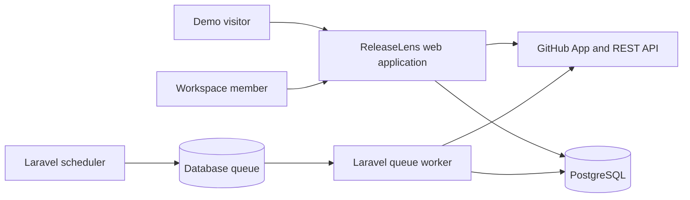
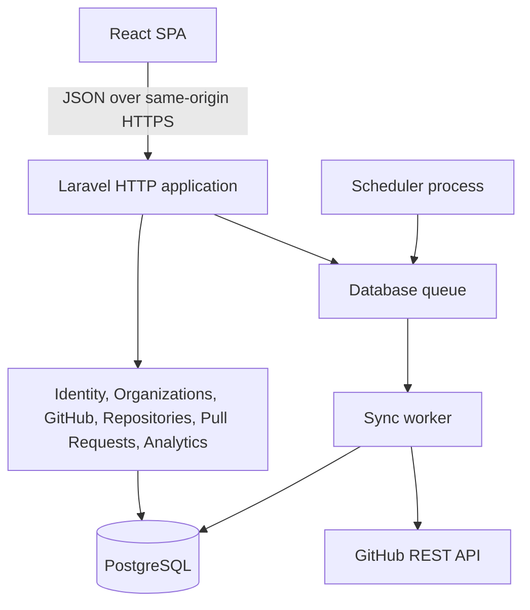
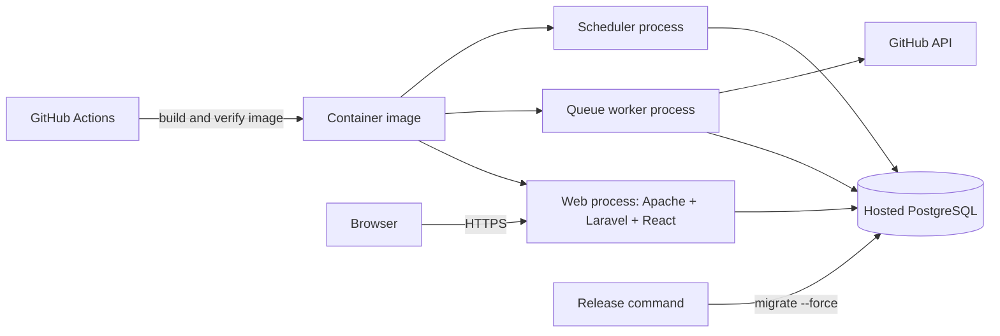

# ReleaseLens Architecture

ReleaseLens is a modular monolith: React owns the browser experience, Laravel owns authorization and domain behavior, PostgreSQL stores normalized source records, and queued jobs synchronize GitHub data.

## System context

The public demo is server-scoped to a synthetic, read-only organization. Connected users authenticate independently from GitHub and access organizations through role-based policies.

## Application containers

Backend modules follow request/controller/service/repository boundaries. Repository contracts are bound in `AppServiceProvider`; policies derive organization access on the server. Frontend features keep API schemas and TanStack Query hooks outside page components, while feature contexts compose view state and actions.

## Synchronization flow

```mermaid
sequenceDiagram
    actor User
    participant API as Laravel API
    participant DB as PostgreSQL
    participant Q as Queue worker
    participant GH as GitHub API

    User->>API: Sync repository
    API->>DB: Create or return active sync run
    API-->>User: 202 queued run
    Q->>DB: Acquire run and repository lock
    Q->>GH: Request bounded PR pages and reviews
    GH-->>Q: Records and rate-limit metadata
    Q->>DB: Idempotent upserts and counters
    Q->>DB: Mark success, partial, deferred, or failed
```

Initial imports are bounded to 90 days or 200 pull requests per repository. Repeated runs use immutable GitHub IDs for idempotency. V1 polls manually and every six hours; webhooks are intentionally deferred.

## Deployment

One production image runs in web, worker, and scheduler roles. The React build is served by Laravel/Apache from the same origin, avoiding cross-site session and callback complexity. See the root `README.md` for commands and environment configuration.

## Trust boundaries

- The browser never receives GitHub installation tokens or private-key material.
- Every organization query is authorized by server-side session context and policy.
- Demo mutations are rejected centrally.
- GitHub credentials are used only by backend clients and short-lived jobs.
- Request correlation IDs are exposed to clients; secrets are redacted from logs.

